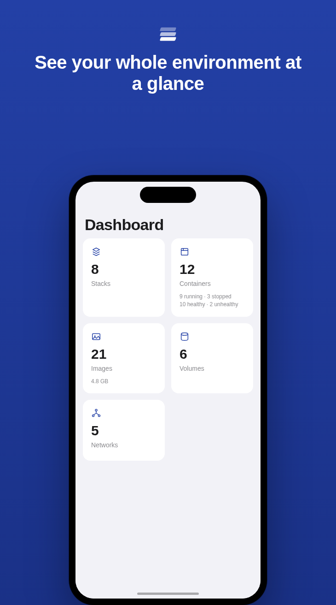
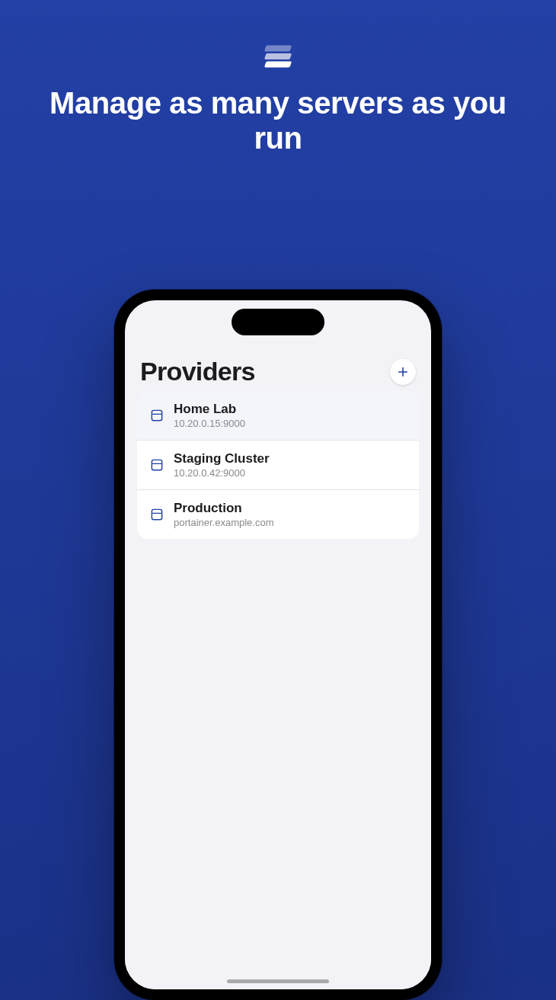
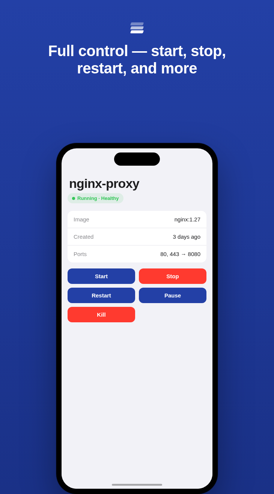
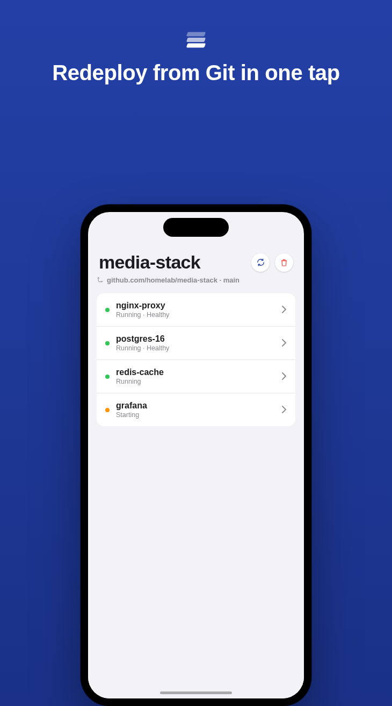

# Drydock

**Your containers, ship-shape.**

Drydock is a native iPhone, iPad, and Mac app for managing Docker environments through [Portainer](https://www.portainer.io/) or [Dockhand](https://github.com/Finsys/dockhand) — no web view, no backend, no account.

🔗 **[drydock.app landing page →](https://edgarclerigo.github.io/drydocker/)**

  
  
  
  

## What it does

- **Add as many servers as you run** — home lab, staging, production — each with its own credentials, stored in the Keychain and never sent anywhere but the server you told it about.
- **See the whole environment at once** — a dashboard per environment: stack count, container health, image count and disk usage, volumes, and networks.
- **Full container control** — start, stop, restart, pause, and kill, with live health and status, right where you're looking at the container.
- **Stacks, kept in sync with Git** — redeploy a Git-backed stack in one tap, edit its repo/branch/auth, or delete it.
- **Find anything, fast** — search across stacks, containers, and images from the dashboard or within any list.
- **Built native, not bolted on** — 100% SwiftUI, an adaptive layout that's genuinely useful on iPad and Mac, and 16 languages.

## Providers

One app, either backend — pick per server, mix Portainer and Dockhand instances in the same provider list.

## Privacy

Drydock doesn't have a server of its own. Credentials live in the iOS/macOS Keychain, on your device, full stop — there's no analytics, no crash reporting service, and no third-party SDKs. It talks directly to the Portainer or Dockhand server you point it at, nothing in between. Full details: [Privacy Policy](https://edgarclerigo.github.io/drydocker/privacy.html).

## Status

Open beta on [TestFlight](https://testflight.apple.com/join/KYA8vNBW) — no waitlist. Public App Store release coming soon.

## About this repo

This repository hosts Drydock's public landing page (via GitHub Pages) and serves as the place to leave feedback. The app's source lives in a private repository, so **please use [Issues](https://github.com/edgarclerigo/drydocker/issues)** here for bug reports and feature requests rather than opening a PR.

---

© 2026 Drydock. Not affiliated with or endorsed by Portainer.io or Dockhand.
